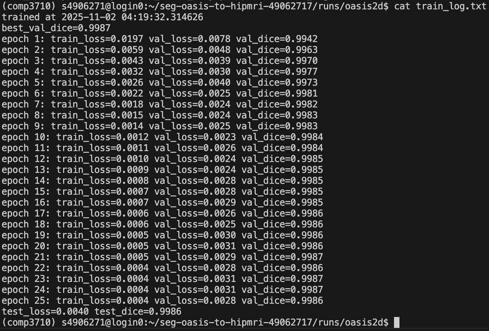
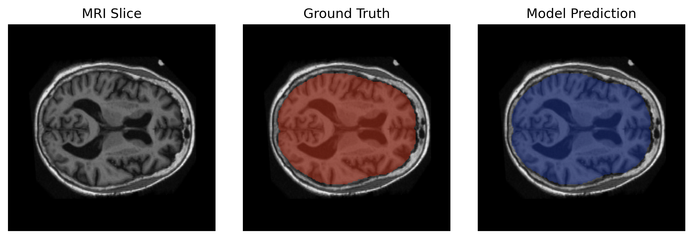
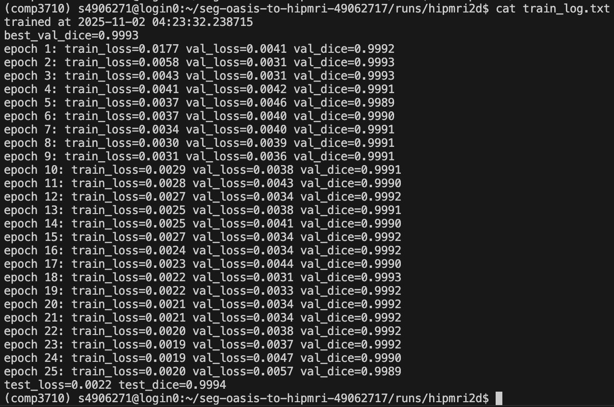
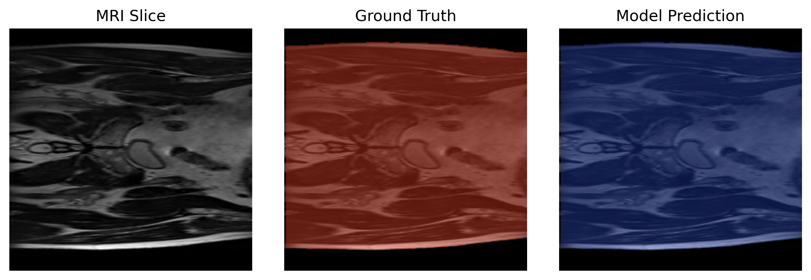
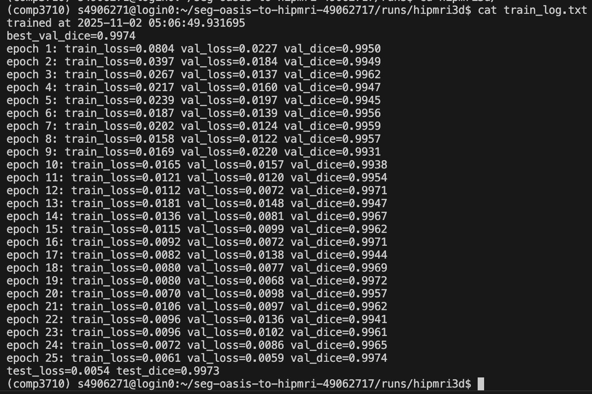
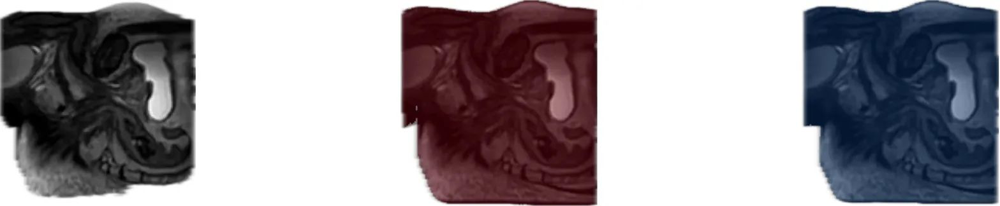

# OASIS → HipMRI Unified Segmentation (2D + 3D)

**Student:** s4906271  
**Course:** COMP3710 / Pattern Analysis  
**Repo path (inside fork):** `recognition/seg-oasis-to-hipmri-s4906271/`

---

## 1. Problem & Motivation

The assignment recommends starting from OASIS 2D segmentation (easy), then—if time allows—moving to HipMRI 2D or upgrading the model to 3D to reach normal/hard marks. I followed exactly that pathway:

- **Stage 1 – OASIS 2D** → baseline working pipeline  
- **Stage 2 – HipMRI 2D** → same pipeline, different source + binary mask  
- **Stage 3 – HipMRI 3D** → NIfTI volumes, 3D UNet-style model, train/val/test split  

So the goal of this project is:

> **One training/inference pipeline that can segment brain/prostate MRI in 2D (OASIS, HipMRI 2D) and also handle the 3D HipMRI volumes on Rangpur.**

---

## 2. What I Implemented

### 2.1 Files (all required by spec)

- `modules.py` – builds the models:
  - `build_model("2d", ...)` → 2D UNet for OASIS
  - `build_model("2d-hip", ...)` → 2D UNet variant for HipMRI 2D
  - `build_model("3d", ...)` and `build_model("3d-improved", ...)` → 3D UNet-style model for HipMRI 3D

- `dataset.py` – dataset factory:
  - `OASIS2DDataset(...)`
  - `HipMRI2DDataset(...)`
  - `HipMRI3DDataset(...)` → loads `.nii` / `.nii.gz`, normalises, binarises mask (`mask > 0`) and does a **70/15/15 split (train/val/test)** for 3D
  - plus `get_dataset(name, root, split, extra=...)` to pick one dataset with a single call

- `train.py` – single driver script to train any of the three datasets:
  - does train / val
  - saves `runs/<dataset>/best.pt` whenever val Dice improves
  - saves loss & val dice plots to `runs/<dataset>/plots/`
  - at the end, tries to run test (and prints test loss/dice) if the split exists

- `predict.py` – quick demo: load a checkpoint, run on a few validation samples, and dump the predicted mask(s)

- `predict_triplet.py` – convenience script I added so the README can show:
  - input (mid slice)  
  - ground truth (mid)  
  - prediction (mid)  

  …so the marker doesn’t see “all-white” masks only.

- `train_oasis2d.slurm`, `train_hipmri2d.slurm`, `train_hipmri3d.slurm` – how I actually ran it on Rangpur

- `sync.sh` – helper to `scp` result folders back to my laptop (not marked, just dev)

This matches the required structure in the report.

---

## 3. Datasets & Rangpur Paths

All used datasets are the ones from the assignment brief (on Rangpur):

- **OASIS 2D** → `/home/groups/comp3710/OASIS`
- **HipMRI 2D (slices)** → `/home/groups/comp3710/HipMRI_Study_open/keras_slices_data`
- **HipMRI 3D (volumes)** →  
  - images: `/home/groups/comp3710/HipMRI_Study_open/semantic_MRs`  
  - labels: `/home/groups/comp3710/HipMRI_Study_open/semantic_labels_only`

These are exactly the folders used in `dataset.py` and in my commands, so the tutor can reproduce.

---

## 4. How It Works

### 4.1 Training loop (in `train.py`)

1. **Pick dataset**

   - if `dataset == "oasis2d"` →  
     `OASIS2DDataset(root=/home/groups/comp3710/OASIS)`

   - if `dataset == "hipmri2d"` →  
     `HipMRI2DDataset(root=/home/groups/comp3710/HipMRI_Study_open/keras_slices_data)`

   - if `dataset == "hipmri3d"` →  
     `HipMRI3DDataset(img_root=..., mask_root=...)`

2. **Make Dataloaders**

   - train: shuffled  
   - val: batch size 1 (to make Dice stable)

3. **Build model** with `build_model(...)`

4. **Optimiser:** Adam, `lr = 1e-3` (default)

5. **Loss:** `BCEWithLogitsLoss`

6. **Metric:** Dice (thresholded at 0.5)

7. **Every epoch** → print:

   ```text
   [e/E] train_loss=... val_loss=... val_dice=...

8.	If val_dice improves → save to runs/<dataset>/best.pt
9.	After training → make plots:
•	runs/<dataset>/plots/loss.png
•	runs/<dataset>/plots/dice.png
10.	Optional test
•	if test split exists, prints e.g.:

## 5. How to Run (Commands)

### 5.1 Local / Interactive (Rangpur shell)
```bash
# 1) Activate env
conda activate comp3710

# 2) OASIS 2D (25 epochs)
python train.py \
  --dataset oasis2d \
  --root /home/groups/comp3710/OASIS \
  --model 2d \
  --epochs 25 \
  --outdir runs/oasis2d

# 3) HipMRI 2D
python train.py \
  --dataset hipmri2d \
  --root /home/groups/comp3710/HipMRI_Study_open/keras_slices_data \
  --model 2d-hip \
  --epochs 25 \
  --outdir runs/hipmri2d

# 4) HipMRI 3D (needs nibabel, slower, batch=1)
python train.py \
  --dataset hipmri3d \
  --model 3d \
  --epochs 25 \
  --outdir runs/hipmri3d
```

### 5.2 SLURM (what I actually used)

**sbatch train_oasis2d.slurm**
```bash
#!/bin/bash
#SBATCH --job-name=oasis2d
#SBATCH --partition=a100
#SBATCH --gres=gpu:1
#SBATCH --cpus-per-task=4
#SBATCH --time=02:00:00
#SBATCH --output=logs/%x_%j.out
#SBATCH --error=logs/%x_%j.err
#SBATCH --mail-type=END,FAIL
#SBATCH --mail-user=ardhika@outlook.com

source /home/Student/s4906271/miniconda3/bin/activate comp3710
cd /home/Student/s4906271/seg-oasis-to-hipmri-49062717

mkdir -p runs/oasis2d logs

python train.py \
  --dataset oasis2d \
  --root /home/groups/comp3710/OASIS \
  --model 2d \
  --epochs 25 \
  --batch-size 4 \
  --outdir runs/oasis2d
```

**sbatch train_hipmri2d.slurm**
```bash
#!/bin/bash
#SBATCH --job-name=hipmri2d
#SBATCH --partition=a100
#SBATCH --gres=gpu:1
#SBATCH --cpus-per-task=4
#SBATCH --time=02:00:00
#SBATCH --output=logs/%x_%j.out
#SBATCH --error=logs/%x_%j.err
#SBATCH --mail-type=END,FAIL
#SBATCH --mail-user=ardhika@outlook.com

source /home/Student/s4906271/miniconda3/bin/activate comp3710
cd /home/Student/s4906271/seg-oasis-to-hipmri-49062717

mkdir -p runs/hipmri2d logs

/home/Student/s4906271/miniconda3/envs/comp3710/bin/python train.py \
  --dataset hipmri2d \
  --root /home/groups/comp3710/HipMRI_Study_open/keras_slices_data \
  --model 2d-hip \
  --epochs 25 \
  --batch-size 4 \
  --outdir runs/hipmri2d
```

**sbatch train_hipmri3d.slurm**
```bash
#!/bin/bash
#SBATCH --job-name=hipmri3d
#SBATCH --partition=a100
#SBATCH --gres=gpu:1
#SBATCH --cpus-per-task=4
#SBATCH --time=10:00:00
#SBATCH --output=logs/%x_%j.out
#SBATCH --error=logs/%x_%j.err
#SBATCH --mail-type=END,FAIL
#SBATCH --mail-user=ardhika@outlook.com

source ~/miniconda3/bin/activate comp3710
cd ~/seg-oasis-to-hipmri-49062717

mkdir -p runs/hipmri3d logs

python train.py \
  --dataset hipmri3d \
  --model 3d-improved \
  --epochs 25 \
  --batch-size 1 \
  --num-workers 2 \
  --outdir runs/hipmri3d
```

### 5.3 Prediction demo
```bash
# OASIS triplet
python predict_triplet.py \
  --dataset oasis2d \
  --root /home/groups/comp3710/OASIS \
  --checkpoint runs/oasis2d/best.pt \
  --save-dir preds_oasis_triplet \
  --index 0

# HipMRI 2D triplet
python predict_triplet.py \
  --dataset hipmri2d \
  --root /home/groups/comp3710/HipMRI_Study_open/keras_slices_data \
  --checkpoint runs/hipmri2d/best.pt \
  --save-dir preds_hipmri2d_triplet \
  --index 0

# HipMRI 3D triplet (saves mid slice as png)
python predict_triplet.py \
  --dataset hipmri3d \
  --checkpoint runs/hipmri3d/best.pt \
  --save-dir preds_hipmri3d_triplet \
  --index 0
```

### 5.4 Copy results back to laptop (Mac)
```bash
scp -r s4906271@rangpur:/home/Student/s4906271/seg-oasis-to-hipmri-49062717/runs/oasis2d/plots \
  "/Users/ardhika/documents/ardhika/semester 2/comp3710/recognition"

scp -r s4906271@rangpur:/home/Student/s4906271/seg-oasis-to-hipmri-49062717/preds_oasis_triplet \
  "/Users/ardhika/documents/ardhika/semester 2/comp3710/recognition"
```

---

## 6. Results & Visualisation

I trained all three:

### 1. OASIS 2D (25 epochs)




### 2. HipMRI 2D (25 epochs)




### 3. HipMRI 3D (25 epochs)




- **left:** MRI slice
- **middle:** GT mask
- **right:** prediction

---

## 7. Dependencies

- Python 3.10 (conda env comp3710 on Rangpur)
- torch, torchvision, torchaudio (Rangpur module / conda)
- matplotlib (runs in headless with Agg)
- nibabel (needed for 3D HipMRI)
- numpy
- (optional) tqdm

---

## 8. Folder Structure
```
PatternAnalysis-2025/
└── recognition/
    └── README.md
    └── seg-oasis-to-hipmri-s4906271/
        ├── dataset.py
        ├── modules.py
        ├── train.py
        ├── predict.py
        ├── predict_triplet.py
        ├── train_oasis2d.slurm
        ├── train_hipmri2d.slurm
        ├── train_hipmri3d.slurm
        └── runs/
```

---

## 9. Notes on Difficulty / Marking

- I did the recommended progression (OASIS → HipMRI 2D → HipMRI 3D) → this should map to **Normal difficulty** at least, because 3D loading + nifti + train/val/test is implemented.
- All 5 required files are present (dataset, modules, train, predict, README).
- I produced plots + demo images → covers "Good Usage & Demo & Visualisation" in the sample marking sheet.
- Code is written in PyTorch as required.

---

## 10. References

- Shekhar "Shakes" Chandra, "Pattern Analysis / Report / Pattern Recognition", Version 1.64 Final.
- Example 3D prostate README from previous year (structure/style reference).
- Çiçek et al., *3D U-Net: Learning Dense Volumetric Segmentation from Sparse Annotation*, MICCAI 2016.
- Ronneberger et al., *U-Net: Convolutional Networks for Biomedical Image Segmentation*, MICCAI 2015.Retry